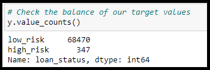
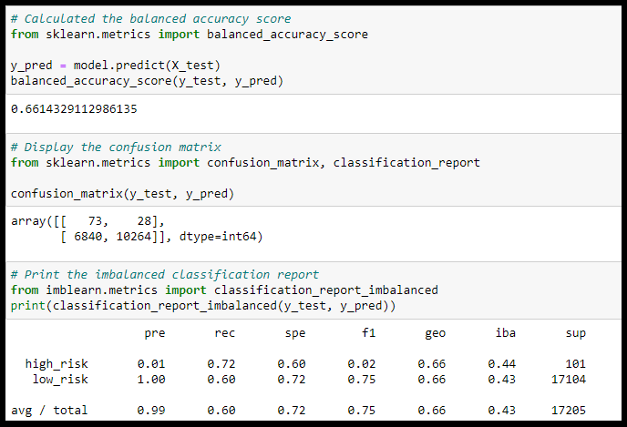
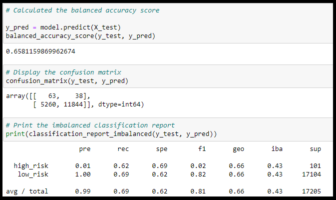
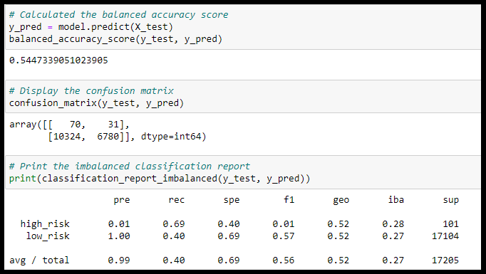
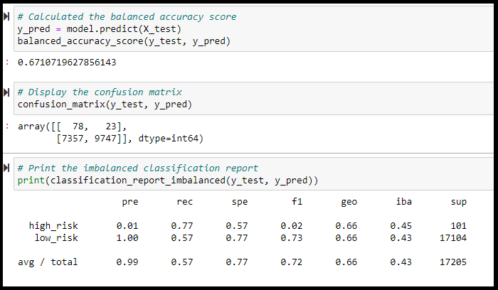
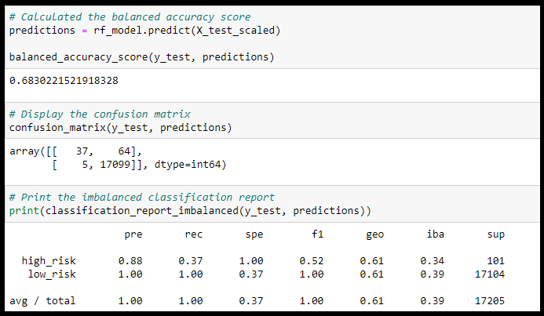
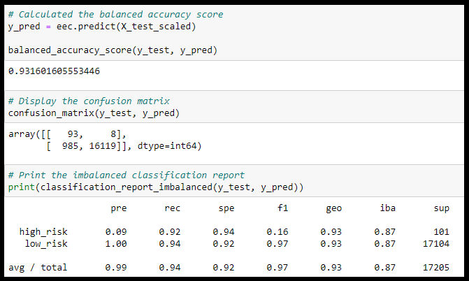

# Credit_Risk_Analysis

## Project Overview
Fast Lending has asked me to assist their lead data scientist to use Machine Learning to predict credit risk. We will be using oversampling, undersampling, a combination of over and undersampling, as well as ensemble classifiers to preform the predictions.

## Resources
- **Data Source**: LoanStats_2019Q1.csv
- **Languages**: Python 3.7.6, Jupyter Notebook, Pandas
- **Software**: Atom 1.63.1, Visual Studio Code 1.74.1

## Results

The y_value_counts, shows that our target "loan_status" is imbalanced with low_risk having 68,470 samples and high_risk only having 347 samples. With this information, we know that we need to adjust the sample sizes this can be done by oversampling, using RandomOverSampler and SMOTE, undersampling, using ClusterCentroids, or a combination method using SMOTEENN.

### Oversampling
**RandomOverSampler**

**SMOTE**

### Undersampling

**ClusterCentroids**

### Combination Oversampling and Undersampling

**SMOTEENN**

### Ensemble Classifers Predictions

#### Balanced accuracy scores
> The average of recall obtained on each class when there are imbalanced datasets.

- **RandomOverSampler**: 0.661
- **SMOTE**: 0.658
- **ClusterCentroids**: 0.545
- **SMOTEENN**: 0.671
- **RandomForest**: 0.683
- **EasyEnsembleClassifier**: 0.932

#### Precision
> The measure of how reliable a positive classification is. The total/average for both sample groups is listed nest to the test type.

- **RandomOverSampler**: 0.99
  - high_risk:0.01
  - low_risk: 1.00
- **SMOTE**: 0.99
  - high_risk: 0.01
  - low_risk: 1.00
- **ClusterCentroids**: 0.99
  - high_risk: 0.01
  - low_risk: 1.00
- **SMOTEENN**: 0.99
  - high_risk: 0.01
  - low_risk: 1.00
- **RandomForest**: 1.00
  - high_risk: 0.88
  - low_risk: 1.00
- **EasyEnsembleClassifier**: 0.99
  - high_risk: 0.09
  - low_risk: 1.00

#### Recall
  > (Sensitivity) The ability of the classifier to find all the positive samples. The total/average for both sample groups is listed next to the test type.

  - **RandomOverSampler**: 0.60
    - high_risk:0.72
    - low_risk: 0.60
  - **SMOTE**: 0.69
    - high_risk:0.62
    - low_risk: 0.69
  - **ClusterCentroids**:0.40
    - high_risk: 0.69
    - low_risk: 0.40
  - **SMOTEENN**:0.57
    - high_risk: 0.77
    - low_risk: 0.57
  - **RandomForest** : 1.00
    - high_risk: 0.37
    - low_risk: 1.00
  - **EasyEnsembleClassifier**: 0.94
    - high_risk: 0.92
    - low_risk :0.94

## Summary

In summary, we started with highly imbalanced datasets. We had thousands more samples of low-risk loan statuses and only a handful of high-risk loans. With just the information provided it was difficult to make a prediction as to loan risk so we had to preform various methods of sampling the data. At first glance based on the balanced accuracy scores, EasyEnsembleClassifier method appears to be the best method to use since it has an accuracy of 93.2%. But when we look at the imbalanced classification report, the precision for correctly finding the high-risk statuses is very low, but is near perfect at finding the low-risk statuses. However, in this situation, it would be preferable to have a more balanced precision for both categories.
